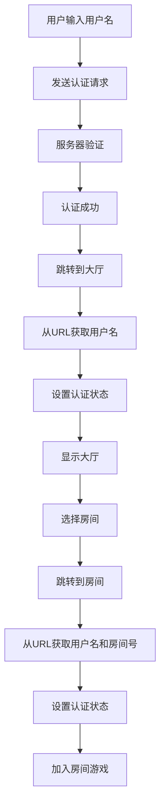

# 斗地主项目 - 极简认证流程

## 核心原则
**用户名就是唯一标识，不要搞那么复杂！！！**

## 简化后的完整流程

### 1. 用户登录
```javascript
// 登录页面
输入用户名 "www" → 发送认证请求 → 服务器验证 → 返回成功 → 直接跳转大厅
```

### 2. 进入大厅
```javascript
// 大厅页面
从URL获取用户名 → 直接设置认证状态 → 显示大厅 → 用户选择房间 → 跳转到房间
```

### 3. 加入房间游戏
```javascript
// 房间页面
从URL获取用户名和房间号 → 直接设置认证状态 → 发送加入房间请求 → 开始游戏
```

## 移除的复杂逻辑

### ❌ 全局状态管理
- 移除复杂的localStorage状态恢复
- 移除页面跳转监听
- 移除状态持久化

### ❌ 认证监听器冲突
- 移除多个认证事件监听器
- 移除Promise认证机制
- 移除认证状态检查

### ❌ 复杂的错误处理
- 移除重试机制
- 移除状态验证
- 移除复杂的调试日志

## 保留的核心功能

### ✅ 基础Socket连接
```javascript
// 全局Socket管理器 - 极简版
class GlobalSocketManager {
    constructor() {
        this.socket = null;
        this.userName = null;
        this.authenticated = false;
        this.connect(); // 直接连接
    }
}
```

### ✅ 用户认证
```javascript
// 登录流程 - 极简版
authenticate(userName) {
    this.socket.emit('authenticate', { userName: userName });
    // 等待服务器响应后直接跳转
}
```

### ✅ 房间游戏
```javascript
// 房间加入 - 极简版
joinGame(data) {
    this.socket.emit('join_game', {
        roomId: data.roomId,
        userId: data.userId,    // 用户名
        playerName: data.playerName
    });
}
```

## 流程图



## 关键简化点

### 1. **用户名即标识**
- 不再需要复杂的用户ID生成
- 用户名直接作为userId使用
- 简化数据传输和验证

### 2. **直接状态设置**
- 不再检查认证状态
- 直接从URL参数设置用户信息
- 立即设置全局状态

### 3. **移除等待逻辑**
- 不再等待状态恢复
- 不再延迟初始化
- 立即执行操作

## 测试验证

### 完整流程测试
1. 清除浏览器缓存
2. 访问登录页面
3. 输入用户名 "www"
4. 验证直接跳转到大厅
5. 在大厅选择房间
6. 验证直接进入房间页面
7. 验证游戏功能正常

### 预期结果
- ✅ 无闪回问题
- ✅ 快速响应
- ✅ 状态一致
- ✅ 用户体验流畅

## 总结

通过移除所有不必要的复杂逻辑，实现了：
- **极简认证**：用户名直接作为标识
- **快速响应**：无等待、无检查、无延迟
- **状态一致**：直接设置，无冲突、无恢复问题
- **代码清晰**：每个页面职责单一，逻辑简单

现在整个流程应该非常简单和可靠！🎉
