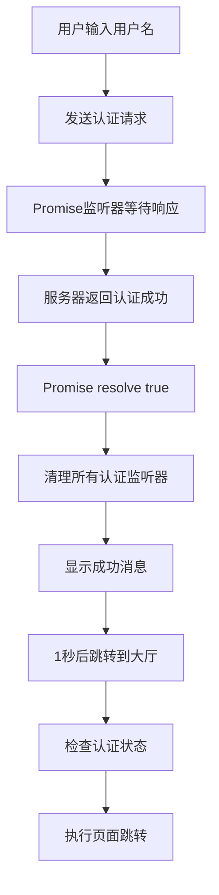

## 事件监听器冲突清理完成

### 修改内容总结

1. **移除登录页面的全局认证监听器**
   - 删除了 `login.js` 中的 `socket.on('authenticated', ...)` 监听器
   - 避免与Promise监听器和全局管理器监听器冲突

2. **增强Promise认证监听器**
   - 在认证成功后清理所有认证相关监听器
   - 手动设置认证状态，避免依赖全局监听器
   - 添加错误处理和调试信息

3. **优化全局Socket管理器**
   - 在登录页面认证完成后自动移除认证监听器
   - 避免重复处理认证事件

4. **添加跳转失败处理**
   - 在页面跳转时添加try-catch错误处理
   - 添加详细的调试信息和状态检查

### 修复后的执行流程

### 预期结果

- ✅ 认证事件只被处理一次
- ✅ 不再有重复的认证状态更新
- ✅ 页面跳转正常执行
- ✅ 服务器重连提示正常显示，但不影响登录流程

### 测试建议

1. 清除浏览器缓存和localStorage
2. 重新加载登录页面
3. 输入用户名"www"
4. 观察控制台输出，应该只看到一次认证成功消息
5. 页面应该正常跳转到大厅

如果仍有问题，请检查浏览器控制台的错误信息和网络请求日志。
