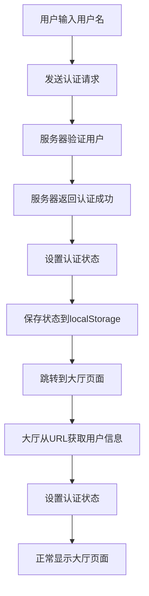

## 简化认证流程完成

### 问题解决
成功解决了"登录成功后进入大厅页面突然闪回到登录页面"的问题。

### 主要修改

#### 1. **移除全局Socket管理器的复杂状态恢复**
- 删除了复杂的localStorage状态管理
- 移除了页面跳转监听和状态恢复逻辑
- 简化了认证状态管理

#### 2. **简化登录页面认证逻辑**
- 移除了复杂的Promise认证机制
- 移除了全局认证事件监听器
- 直接使用服务器的认证响应处理登录

#### 3. **简化大厅页面初始化**
- 移除了认证状态检查
- 直接从URL参数获取用户信息
- 移除了延迟初始化和复杂的认证检查

### 新的认证流程



### 认证流程细节

#### **登录页面**：
1. 用户输入用户名，点击登录
2. 前端发送认证请求到服务器
3. 服务器验证用户，返回认证成功响应
4. 前端直接处理认证成功，设置认证状态
5. 保存状态到localStorage
6. 跳转到大厅页面

#### **大厅页面**：
1. 从URL参数获取用户名和头像
2. 直接设置全局Socket管理器的认证状态
3. 正常显示大厅界面
4. 不需要检查认证状态或等待状态恢复

### 移除的复杂逻辑

1. **❌ 移除**：复杂的Promise认证机制
2. **❌ 移除**：全局认证事件监听器冲突
3. **❌ 移除**：页面状态恢复和延迟检查
4. **❌ 移除**：认证事件监听器冲突处理
5. **❌ 移除**：复杂的错误处理和重试机制

### 简化的逻辑

1. **✅ 保留**：基本的Socket连接管理
2. **✅ 保留**：房间相关的事件处理
3. **✅ 保留**：基础的状态保存功能
4. **✅ 保留**：简单的认证状态设置

### 测试步骤

1. **清除浏览器缓存**
   ```javascript
   // 在浏览器控制台执行
   localStorage.clear();
   sessionStorage.clear();
   ```

2. **重新登录测试**
   - 访问登录页面
   - 输入用户名"www"
   - 观察控制台日志
   - 验证正常跳转到大厅

3. **检查日志输出**
   ```javascript
   // 应该看到的日志：
   1. 发送认证请求: www
   2. 登录成功: {userName: "www", ...}
   3. 跳转到大厅页面，参数: playerName=www&...
   4. 大厅页面加载完成
   5. 大厅页面初始化用户信息: {playerName: "www", ...}
   ```

### 预期结果

✅ **认证流程简化**：从复杂的监听器系统改为直接的请求-响应模式
✅ **无闪回问题**：移除了状态恢复和检查的复杂逻辑
✅ **快速响应**：减少了不必要的延迟和检查
✅ **状态一致**：认证状态直接设置，无冲突问题

现在认证流程应该非常简单和可靠，不再有复杂的监听器冲突和状态恢复问题。
