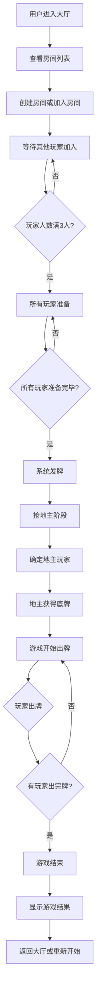
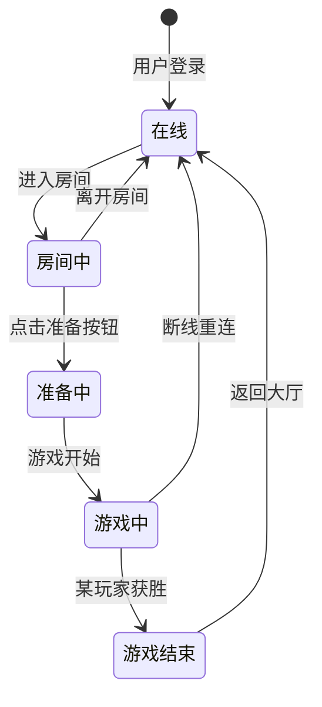
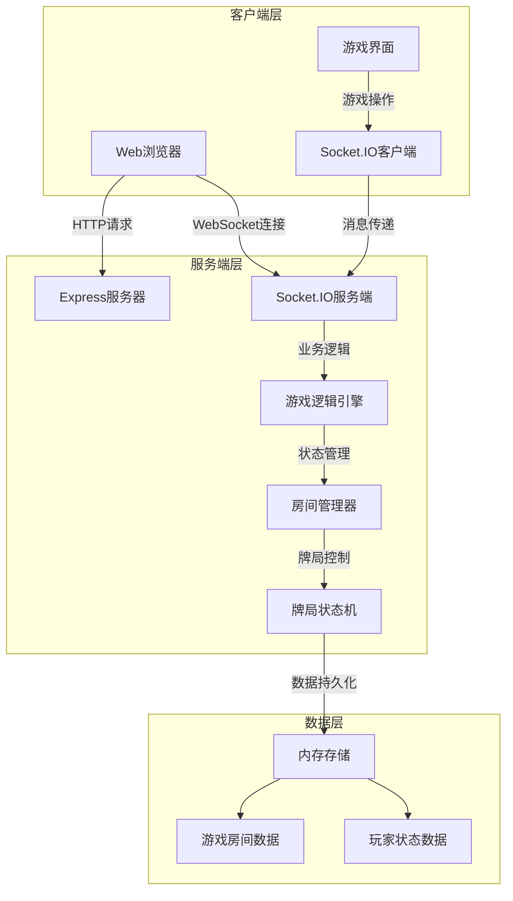
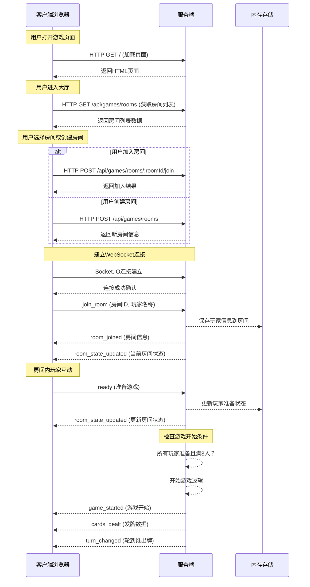
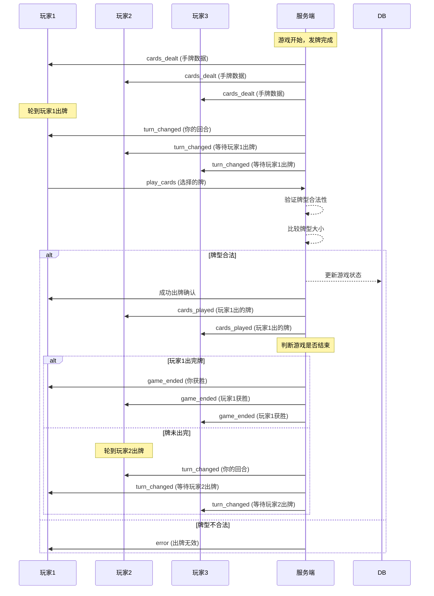
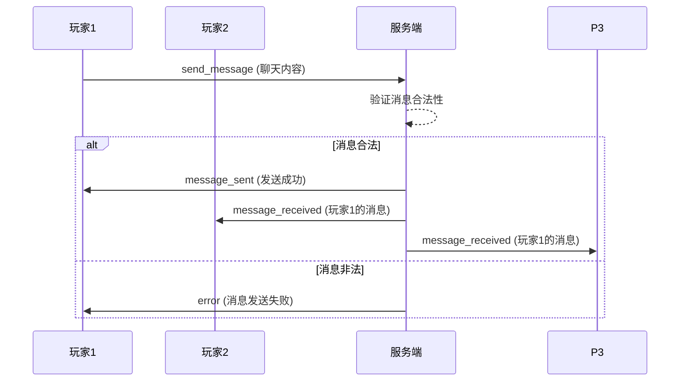
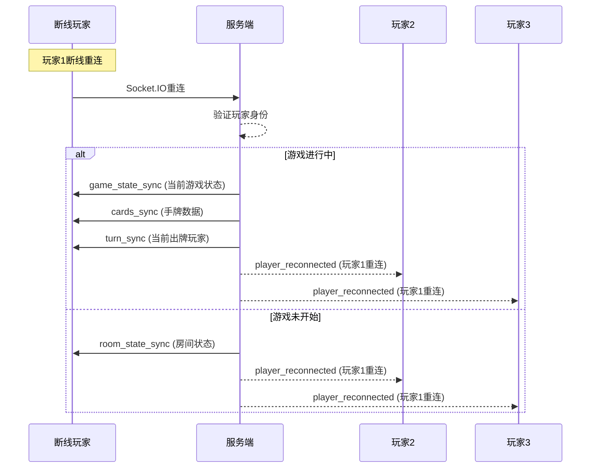

# 斗地主游戏设计文档

## 游戏概述

斗地主是一款经典的多人纸牌游戏，通常由3人参与，使用一副54张扑克牌（52张标准牌+2张王牌）。游戏目标是通过出牌来成为第一个出完手中所有牌的玩家。

## 游戏规则

### 基本规则
- **玩家人数**: 3人（一方地主，两方农民）
- **牌数**: 54张（包括大小王）
- **发牌**: 每人17张，剩余3张作为底牌
- **地主**: 通过抢地主或叫地主决定
- **获胜条件**: 先出完所有牌的一方获胜

### 牌型规则
1. **单牌**: 一张牌
2. **对子**: 两张相同点数的牌
3. **三条**: 三张相同点数的牌
4. **三带一**: 三张相同点数的牌+一张单牌
5. **三带对**: 三张相同点数的牌+一对
6. **顺子**: 五张或更多连续点数的牌
7. **连对**: 三对或更多连续对子
8. **飞机**: 两组或更多连续三条
9. **炸弹**: 四张相同点数的牌
10. **王炸**: 大小王组合

### 牌型大小比较
- 单牌: 2 > A > K > Q > J > 10 > 9 > 8 > 7 > 6 > 5 > 4 > 3
- 顺子: 按最大牌比较
- 炸弹 > 任何牌型
- 王炸 > 任何炸弹

## 游戏流程设计



## 玩家状态机



## 前后端架构设计

### 技术栈
- **前端**: HTML5 + CSS3 + JavaScript + Socket.IO客户端
- **后端**: Node.js + Express + Socket.IO服务端
- **数据库**: 暂无需持久化存储（内存存储）
- **部署**: 单机部署，支持多人同时在线

### 系统架构图



## 数据结构设计

### 房间数据结构
```typescript
interface GameRoom {
  id: string;                    // 房间唯一标识
  name: string;                  // 房间名称
  players: Player[];             // 玩家列表
  maxPlayers: number;            // 最大玩家数
  status: 'waiting' | 'playing' | 'finished';
  currentPlayerIndex: number;    // 当前出牌玩家索引
  landlord: Player | null;       // 地主玩家
  cards: {
    remaining: Card[];           // 剩余底牌
    played: Card[][];           // 已出牌历史
    lastPlayed?: Card[];        // 最后出牌
  };
  createdAt: Date;
  updatedAt: Date;
}
```

### 玩家数据结构
```typescript
interface Player {
  id: string;                    // 玩家唯一标识
  name: string;                  // 玩家昵称
  avatar?: string;               // 头像
  isReady: boolean;              // 是否准备
  isOnline: boolean;             // 是否在线
  cards?: Card[];                // 手牌
  seatIndex?: number;            // 座位号
}
```

### 牌型数据结构
```typescript
interface Card {
  suit: 'hearts' | 'diamonds' | 'clubs' | 'spades';
  rank: '3' | '4' | '5' | '6' | '7' | '8' | '9' | '10' | 'J' | 'Q' | 'K' | 'A' | '2';
  value: number;                 // 牌值（用于比较）
}

interface CardCombination {
  type: 'single' | 'pair' | 'three' | 'three_with_one' | 'three_with_pair' |
        'straight' | 'consecutive_pairs' | 'airplane' | 'bomb' | 'rocket';
  cards: Card[];
  value: number;                 // 牌型大小值
}
```

## 前后端消息交互设计

### WebSocket事件定义

#### 客户端到服务端事件
```typescript
interface ClientToServerEvents {
  // 房间管理
  join_room: (roomId: string, playerName: string) => void;
  leave_room: () => void;
  ready: () => void;

  // 游戏流程
  grab_landlord: (isGrab: boolean) => void;
  play_cards: (cards: Card[]) => void;
  pass_turn: () => void;

  // 聊天功能
  send_message: (message: string) => void;
}
```

#### 服务端到客户端事件
```typescript
interface ServerToClientEvents {
  // 房间状态
  room_joined: (room: GameRoom) => void;
  room_left: (roomId: string) => void;
  player_joined: (player: Player) => void;
  player_left: (playerId: string) => void;
  room_state_updated: (room: GameRoom) => void;

  // 游戏流程
  game_started: (gameRoom: GameRoom) => void;
  cards_dealt: (cards: Card[]) => void;
  landlord_selected: (landlord: Player, bottomCards: Card[]) => void;
  turn_changed: (nextPlayerId: string, lastPlayed?: Card[]) => void;
  cards_played: (playerId: string, cards: Card[]) => void;
  game_ended: (winner: Player, reason: string) => void;

  // 聊天功能
  message_received: (playerName: string, message: string) => void;
  error: (message: string) => void;
}
```

### HTTP API接口设计

#### 房间管理API
```
GET    /api/games/rooms           # 获取所有房间列表
POST   /api/games/rooms           # 创建新房间
GET    /api/games/rooms/:roomId   # 获取房间详情
```

#### 游戏控制API
```
POST   /api/games/rooms/:roomId/join    # 加入房间
POST   /api/games/rooms/:roomId/ready   # 玩家准备
POST   /api/games/rooms/:roomId/leave   # 离开房间
```

## 游戏逻辑实现指南

### 1. 房间管理系统
- 房间创建与销毁
- 玩家加入/离开处理
- 房间状态同步

### 2. 牌局控制引擎
- 洗牌发牌算法
- 牌型识别与比较
- 出牌合法性验证
- 游戏状态管理

### 3. 抢地主机制
- 抢地主轮次控制
- 地主确定逻辑
- 底牌分配

### 4. 出牌逻辑
- 牌型验证算法
- 牌型大小比较
- 出牌顺序控制
- 游戏结束判断

## 用户界面设计

### 1. 大厅界面
- 房间列表展示
- 创建房间表单
- 快速加入功能

### 2. 房间界面
- 玩家座位布局
- 准备状态显示
- 游戏控制按钮
- 聊天区域

### 3. 游戏界面
- 手牌展示区域
- 出牌区域
- 其他玩家牌数显示
- 游戏操作按钮（出牌、提示、跳过）

## 安全性考虑

1. **输入验证**: 所有用户输入需验证合法性
2. **状态同步**: 服务端权威，客户端同步
3. **防作弊**: 出牌验证、牌型检查
4. **连接管理**: 处理断线重连

## 性能优化建议

1. **内存管理**: 定期清理无用房间数据
2. **并发控制**: 使用锁机制避免竞态条件
3. **消息压缩**: WebSocket消息体量控制
4. **缓存策略**: 常用数据缓存

## 测试策略

### 单元测试
- 牌型识别算法
- 出牌合法性验证
- 游戏状态转换

### 集成测试
- 完整游戏流程
- 多玩家互动
- 网络异常处理

### 用户体验测试
- 界面交互流畅性
- 响应速度测试
- 兼容性测试

## 消息交互详细设计

### 1. 用户进入游戏流程交互时序



### 2. 游戏进行中交互时序



### 3. 抢地主阶段交互时序

```mermaid
sequenceDiagram
    participant P1 as 玩家1
    participant P2 as 玩家2
    participant P3 as 玩家3
    participant S as 服务端

    Note over S: 游戏开始，发牌完成
    S->>P1: game_started (游戏开始)
    S->>P2: game_started (游戏开始)
    S->>P3: game_started (游戏开始)

    Note over P1,P2,P3: 抢地主阶段开始
    S->>P1: landlord_selection (轮到你抢地主)
    S->>P2: landlord_selection (等待玩家1选择)
    S->>P3: landlord_selection (等待玩家1选择)

    P1->>S: grab_landlord (true/false)
    alt 玩家1抢地主
        S-->>S: 玩家1成为地主
        S->>P1: landlord_selected (你是地主)
        S->>P2: landlord_selected (玩家1是地主)
        S->>P3: landlord_selected (玩家1是地主)
        S->>P1: cards_dealt (底牌)
    else 玩家1不抢
        S->>P2: landlord_selection (轮到你抢地主)
        S->>P1: landlord_selection (等待玩家2选择)
        S->>P3: landlord_selection (等待玩家2选择)

        P2->>S: grab_landlord (true/false)
        alt 玩家2抢地主
            S-->>S: 玩家2成为地主
            S->>P2: landlord_selected (你是地主)
            S->>P1: landlord_selected (玩家2是地主)
            S->>P3: landlord_selected (玩家2是地主)
            S->>P2: cards_dealt (底牌)
        else 玩家2不抢
            S->>P3: landlord_selection (轮到你抢地主)
            S->>P1: landlord_selection (等待玩家3选择)
            S->>P2: landlord_selection (等待玩家3选择)

            P3->>S: grab_landlord (true/false)
            alt 玩家3抢地主
                S-->>S: 玩家3成为地主
                S->>P3: landlord_selected (你是地主)
                S->>P1: landlord_selected (玩家3是地主)
                S->>P2: landlord_selected (玩家3是地主)
                S->>P3: cards_dealt (底牌)
            else 玩家3不抢
                Note over S: 重新发牌或结束游戏
            end
        end
    end
```

### 4. 聊天系统交互时序



### 5. 断线重连处理时序



## 消息格式定义

### WebSocket消息格式

#### 客户端发送消息格式
```typescript
// 加入房间
{
  type: 'join_room',
  data: {
    roomId: string,
    playerName: string
  }
}

// 出牌
{
  type: 'play_cards',
  data: {
    cards: Card[],
    roomId: string
  }
}

// 聊天
{
  type: 'send_message',
  data: {
    message: string,
    roomId: string
  }
}
```

#### 服务端广播消息格式
```typescript
// 房间状态更新
{
  type: 'room_state_updated',
  data: {
    room: GameRoom
  }
}

// 出牌通知
{
  type: 'cards_played',
  data: {
    playerId: string,
    playerName: string,
    cards: Card[]
  }
}

// 游戏结束
{
  type: 'game_ended',
  data: {
    winner: Player,
    reason: string,
    gameStats: {
      totalRounds: number,
      duration: number
    }
  }
}
```

### HTTP API响应格式

#### 统一响应格式
```typescript
{
  success: boolean,
  data?: any,
  message?: string,
  error?: string,
  timestamp: string
}
```

#### 分页响应格式
```typescript
{
  success: true,
  data: {
    items: any[],
    pagination: {
      currentPage: number,
      pageSize: number,
      total: number,
      totalPages: number
    }
  }
}
```

## 错误处理机制

### 错误类型分类
1. **网络错误**: 连接断开、超时等
2. **业务逻辑错误**: 出牌非法、操作无效等
3. **系统错误**: 服务端异常、数据库错误等

### 错误响应格式
```typescript
{
  success: false,
  error: {
    code: string,        // 错误代码
    message: string,     // 错误信息
    details?: any        // 详细错误信息
  },
  timestamp: string
}
```

### 常见错误码定义
- `INVALID_CARDS`: 出牌不符合规则
- `NOT_YOUR_TURN`: 未轮到该玩家出牌
- `ROOM_FULL`: 房间已满
- `GAME_ALREADY_STARTED`: 游戏已开始
- `INVALID_ROOM`: 房间不存在
- `PLAYER_NOT_FOUND`: 玩家不存在

## 牌型识别算法设计

### 牌值映射表
```typescript
const CARD_VALUES = {
  '3': 3, '4': 4, '5': 5, '6': 6, '7': 7, '8': 8, '9': 9, '10': 10,
  'J': 11, 'Q': 12, 'K': 13, 'A': 14, '2': 15,
  '🃏': 16,  // 小王
  '🂠': 17   // 大王
};

const CARD_RANKS = ['3', '4', '5', '6', '7', '8', '9', '10', 'J', 'Q', 'K', 'A', '2', '🃏', '🂠'];
```

### 牌型识别函数
```typescript
interface CardCombination {
  type: string;
  value: number;
  cards: Card[];
}

function identifyCardCombination(cards: Card[]): CardCombination | null {
  if (cards.length === 0) return null;

  // 按牌值排序
  const sortedCards = [...cards].sort((a, b) => CARD_VALUES[a.rank] - CARD_VALUES[b.rank]);

  // 单牌
  if (cards.length === 1) {
    return { type: 'single', value: CARD_VALUES[cards[0].rank], cards };
  }

  // 对子
  if (cards.length === 2 && cards[0].rank === cards[1].rank) {
    return { type: 'pair', value: CARD_VALUES[cards[0].rank], cards };
  }

  // 三条
  if (cards.length === 3 && cards.every(card => card.rank === cards[0].rank)) {
    return { type: 'three', value: CARD_VALUES[cards[0].rank], cards };
  }

  // 三带一
  if (cards.length === 4) {
    const values = [...new Set(cards.map(card => card.rank))];
    if (values.length === 2) {
      const threeValue = values.find(v => cards.filter(c => c.rank === v).length === 3);
      if (threeValue) {
        return { type: 'three_with_one', value: CARD_VALUES[threeValue], cards };
      }
    }
  }

  // 三带对
  if (cards.length === 5) {
    const values = [...new Set(cards.map(card => card.rank))];
    if (values.length === 2) {
      const threeValue = values.find(v => cards.filter(c => c.rank === v).length === 3);
      if (threeValue) {
        return { type: 'three_with_pair', value: CARD_VALUES[threeValue], cards };
      }
    }
  }

  // 顺子
  if (cards.length >= 5 && cards.length <= 12) {
    const isStraight = sortedCards.every((card, index) =>
      index === 0 || CARD_VALUES[card.rank] === CARD_VALUES[sortedCards[index - 1].rank] + 1
    );
    if (isStraight && CARD_VALUES[sortedCards[0].rank] >= 3 && CARD_VALUES[sortedCards[cards.length - 1].rank] <= 14) {
      return { type: 'straight', value: CARD_VALUES[sortedCards[cards.length - 1].rank], cards };
    }
  }

  // 连对
  if (cards.length >= 6 && cards.length % 2 === 0) {
    const pairs = [];
    for (let i = 0; i < cards.length; i += 2) {
      if (cards[i].rank !== cards[i + 1].rank) break;
      pairs.push(cards[i].rank);
    }
    if (pairs.length === cards.length / 2 && pairs.length >= 3) {
      const isConsecutivePairs = pairs.every((pair, index) =>
        index === 0 || CARD_VALUES[pair] === CARD_VALUES[pairs[index - 1]] + 1
      );
      if (isConsecutivePairs) {
        return { type: 'consecutive_pairs', value: CARD_VALUES[pairs[pairs.length - 1]], cards };
      }
    }
  }

  // 飞机（连续三条）
  if (cards.length >= 6 && cards.length % 3 === 0) {
    const groups = [];
    for (let i = 0; i < cards.length; i += 3) {
      if (cards[i].rank !== cards[i + 1].rank || cards[i].rank !== cards[i + 2].rank) break;
      groups.push(cards[i].rank);
    }
    if (groups.length === cards.length / 3 && groups.length >= 2) {
      const isConsecutive = groups.every((group, index) =>
        index === 0 || CARD_VALUES[group] === CARD_VALUES[groups[index - 1]] + 1
      );
      if (isConsecutive) {
        return { type: 'airplane', value: CARD_VALUES[groups[groups.length - 1]], cards };
      }
    }
  }

  // 炸弹
  if (cards.length === 4 && cards.every(card => card.rank === cards[0].rank)) {
    return { type: 'bomb', value: CARD_VALUES[cards[0].rank], cards };
  }

  // 王炸
  if (cards.length === 2 && cards.some(card => card.rank === '🃏') && cards.some(card => card.rank === '🂠')) {
    return { type: 'rocket', value: 999, cards };
  }

  return null;
}
```

这份设计文档为斗地主游戏的完整开发提供了详细的技术指导，涵盖了游戏规则、系统架构、算法设计、前后端交互协议、用户界面设计、性能优化等各个方面。开发团队可以依据此文档进行高效的开发工作。
